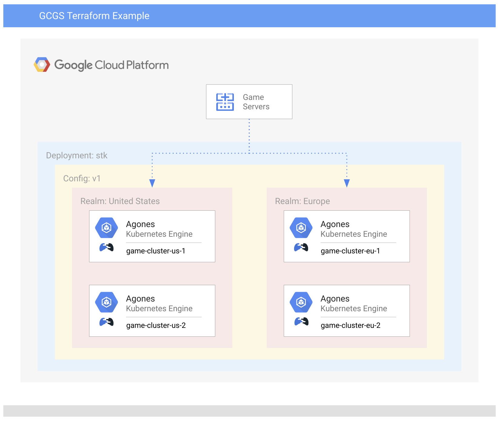

# Terraform Example with 4 Clusters and 2 Realms

[](https://ssh.cloud.google.com/cloudshell/editor?cloudshell_git_repo=https%3A%2F%2Fgithub.com%2Fgoogleforgames%2Fcloud-game-servers-examples&cloudshell_working_dir=terraform-4-cluster)

## Overview

This is an example of using [Terraform][tf] to create the supporting infrastructure for Google
Cloud Game Servers as well as create and rollout a Fleet across all the Game Server Clusters. 

This example:

- Creates 4 GKE Clusters:
  - 2 in us-central1, in separate zones
  - 2 in europe-west4, in separate zones
- Install [Agones][agones] in all 4 clusters
- Install [Citadel][citadel] in each cluster
- Create a "europe" and "united-states" Realms
- Register each cluster with the appropriate Realm
- Create a Deployment, "stk" (SuperTuxKart)
- Create a Config with a Fleet of [SuperTuxKart][stk] dedicated game servers
- Rollout the Config across all the clusters



## Quota Requirements

You may need to increase your
[Google Cloud Project Quotas for CPUs and External IP addresses](https://console.cloud.google.com/iam-admin/quotas), as this example creates
4 clusters, each with 6 n1-standard-4 nodes - 2 in europe-west4 and 2 in us-central1.

## Running the example

Before running the example, make sure you have applied the IAM permission changes outlined in
[Registering a cluster](https://cloud.google.com/game-servers/docs/how-to/registering-cluster#registering_a_cluster).

To create the example in your project:

```shell script
cd terraform-4-cluster
terraform init
terraform apply -var project="<YOUR_GCP_ProjectID>"
```

## Multi-cluster Allocation

We're still working out how to configure the certificate authentication part of Multi-cluster allocation to Terraform.

In the meantime, `gen-certs.sh` will create and apply the requisite certificates, as well as save them locally for
authentication against the [allocation service](https://agones.dev/site/docs/advanced/allocator-service/).

`allocate.sh` also provides a convenience script for passing those certificates to the 
[allocator sample client](https://agones.dev/site/docs/advanced/multi-cluster-allocation/#allocate-multi-cluster). To
use this script export the environment variable `ALLOCATION_PATH` to point to the 
[allocator sample client](https://agones.dev/site/docs/advanced/multi-cluster-allocation/#allocate-multi-cluster)
directory.

[tf]: https://www.terraform.io/
[agones]: https://agones.dev/
[citadel]: https://istio.io/docs/ops/deployment/architecture/#citadel
[stk]: https://supertuxkart.net/